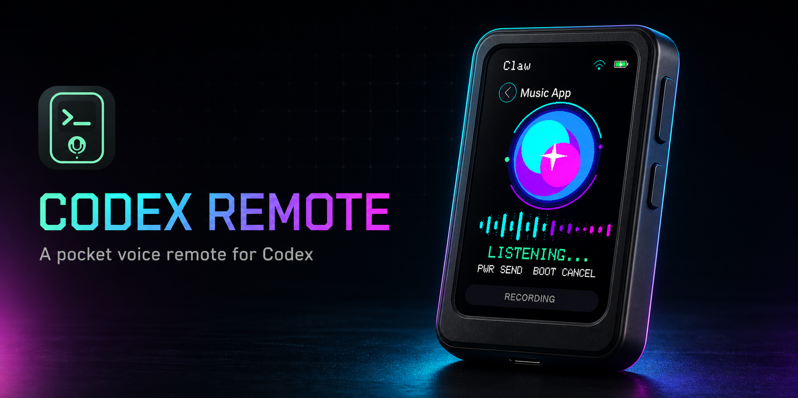
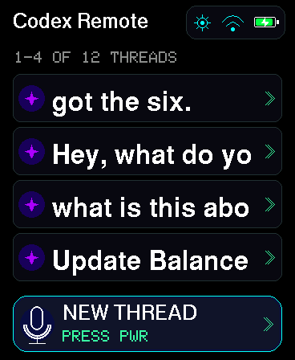
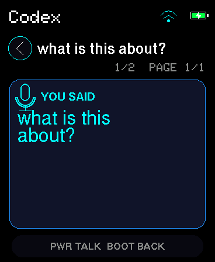
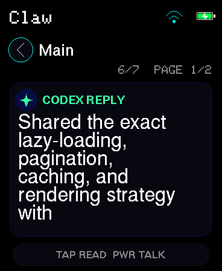
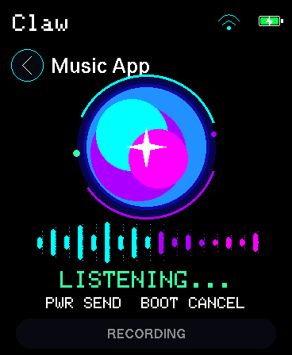
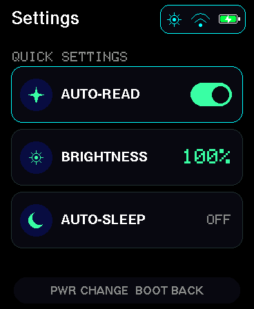

# Codex Remote

<p align="center">
  
</p>

Codex Remote turns a Waveshare ESP32-S3-Touch-AMOLED-1.8 into a pocket
controller for Codex conversations running on a desktop computer.

The project has two parts:

- A macOS Electron host that connects to the desktop-owned Codex app-server,
  advertises itself on the local network, pairs devices, transcribes microphone
  audio, and streams assistant speech.
- Native PlatformIO/Arduino firmware for the Waveshare board. It discovers
  hosts, lists agents and conversations, records prompts, displays the latest
  five summarized turns, and plays assistant replies.

The host and device communicate only over the local network. The ESP32 does not
connect directly to Codex or store an OpenAI API key.

## Supported setup

The complete voice experience currently targets:

- macOS host
- Waveshare ESP32-S3-Touch-AMOLED-1.8 V1 or V2
- 2.4 GHz Wi-Fi for the ESP32; the Mac may use any band on the same LAN
- an authenticated Codex desktop session

Windows and Linux can run much of the host code, but local transcription and
Apple speech fallback are macOS-specific. They are not yet the recommended
first-install path.

## The device experience

These are framebuffer captures from the real 368 x 448 AMOLED firmware. Click
any screen to inspect it at native resolution.

<table>
  <tr>
    <td align="center">
      <a href="docs/images/device-threads.png"></a><br>
      <sub><strong>Browse</strong></sub>
    </td>
    <td align="center">
      <a href="docs/images/device-user-message.png"></a><br>
      <sub><strong>Ask</strong></sub>
    </td>
    <td align="center">
      <a href="docs/images/device-assistant-message.png"></a><br>
      <sub><strong>Read</strong></sub>
    </td>
    <td align="center">
      <a href="docs/images/device-recording.png"></a><br>
      <sub><strong>Speak</strong></sub>
    </td>
    <td align="center">
      <a href="docs/images/device-settings.png"></a><br>
      <sub><strong>Tune</strong></sub>
    </td>
  </tr>
</table>

## Start here

For a new machine and device, follow [Setup from a clean clone](docs/SETUP.md).
It covers prerequisites, the SDK checkout, factory-firmware backup, Wi-Fi,
building and flashing V1/V2 firmware, the macOS host, pairing, and a smoke test.

The short version is:

1. Clone `codex-app-sdk` and `codex-remote` beside each other.
2. Install and build the SDK, then install Codex Remote.
3. Back up the factory flash before the first upload.
4. Copy `credentials.h.example` to the ignored `credentials.h` and enter a
   2.4 GHz Wi-Fi SSID and password.
5. Build and flash the firmware matching the V1/V2 label on the board.
6. Start or install the macOS host, open pairing, and approve the code shown on
   the device.

## Voice and the OpenAI API key

An OpenAI API key is optional on macOS.

| Host configuration | Spoken prompts | Assistant read-aloud |
| --- | --- | --- |
| No `OPENAI_API_KEY` | Apple SpeechAnalyzer on the Mac | Apple `say` using the Samantha voice |
| `OPENAI_API_KEY` set | Codex realtime when available, with local transcription fallback | OpenAI `gpt-4o-mini-tts`, with Apple speech fallback if the request cannot start |

The regular ChatGPT-authenticated Codex session does not require an API key.
Without a key, both push-to-talk and read-aloud still work on macOS. The key is
used only by the host and must never be added to ESP32 `credentials.h`.

See [Configuration and secrets](docs/CONFIGURATION.md) for exact `.env.local`
locations, override variables, security boundaries, and the full voice matrix.

## Device controls

The physical-button convention is consistent throughout the firmware:

- **BOOT = Back or cancel**
- **PWR = Confirm or perform the primary action**

In a conversation, PWR supports both recording styles without a setting:

- Tap PWR to start, speak, then tap PWR again to send.
- Hold PWR for roughly half a second, speak while holding, then release to send.

The PMU's hardware long-press shutdown is temporarily disabled while recording,
so push-to-talk cannot turn the board off. Outside recording, holding PWR for
about ten seconds powers the device down.

Tap the status pill at the top of any screen to open device settings. Settings
include auto-read, brightness, and screen auto-sleep. See
[Using the device](docs/DEVICE.md) for every screen, gesture, and setting.

## Documentation

- [Setup from a clean clone](docs/SETUP.md)
- [Configuration and secrets](docs/CONFIGURATION.md)
- [Using the device](docs/DEVICE.md)
- [Development, architecture, and releases](docs/DEVELOPMENT.md)
- [Troubleshooting](docs/TROUBLESHOOTING.md)

## Common development commands

```bash
npm run dev
npm test
npm run typecheck
npm run build
npm run firmware:build
npm run firmware:upload:v2
npm run firmware:monitor
npm run device:screenshot
```

The browser simulator is available from **Open Device Simulator** in the host's
menu-bar item. It uses the real host API and is the fastest way to iterate on
behavior before flashing hardware.

## Hardware and upstream sources

The firmware targets the
[Waveshare ESP32-S3-Touch-AMOLED-1.8](https://docs.waveshare.com/ESP32-S3-Touch-AMOLED-1.8):
a 368 x 448 AMOLED board with a microphone, speaker, capacitive touch,
AXP2101 power management, 8 MB PSRAM, and 16 MB flash. V1 uses the
SH8601/FT3168 display and touch controllers; V2 uses CO5300/CST820.

Hardware bring-up and the ES8311 audio path are adapted from
[steveruizok/chat-stick](https://github.com/steveruizok/chat-stick). The framed
local-audio and mDNS design was informed by
[nicosuave/m5mic](https://github.com/nicosuave/m5mic). See `third-party/` for
licenses and attribution.
